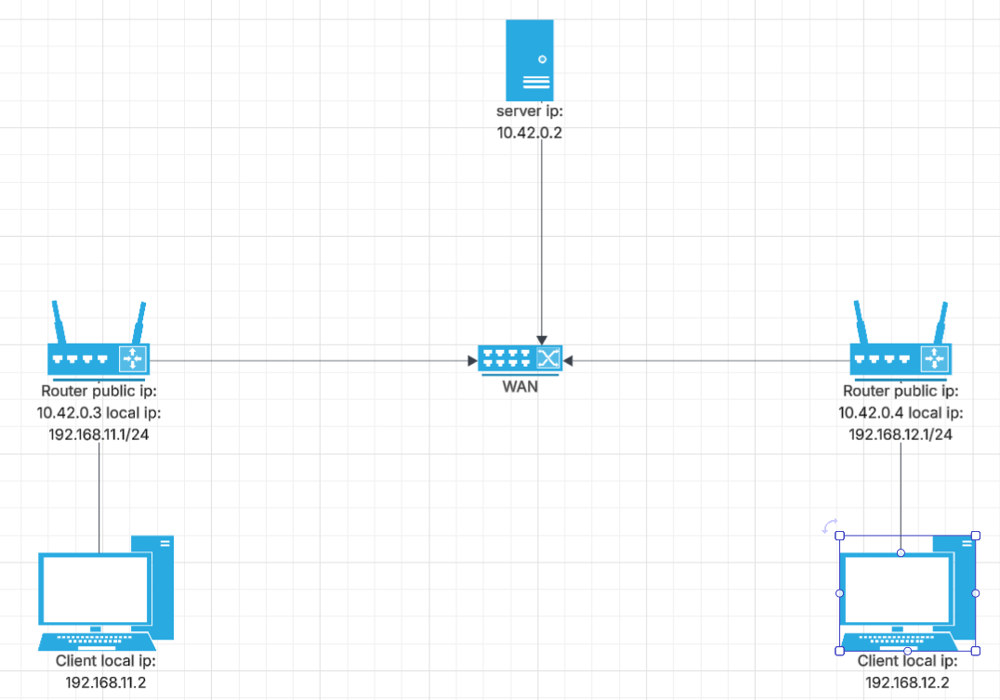

# UDP-hole-punching

UDP hole punching is a method to create a connection between two computers in different local networks without the need to forward a port.

In a traditional networking environment a connection between two computers is created using a server-client model where one computer takes the role of a server and waits for a connection from the client through a specific port that is forwarded outside the local network. This works well but sometimes none of the two computers can take the role of a server because they just can't forward a port (example: two phones using mobile data or using a public wi-fi). A workaround for this is to have another server and have both clints send data through the server in a client-server-client model but this adds a lot of delay between messages and is just inefficient. This is what UDP hole punching fixes it still uses a client-server-client but instead of sending all data through the server it uses the server only to open up a connection through which the clients send data to each other directly.

This repository shows an example of a client and server capable of sending data between two clients using UDP hole punching.

## Docker

The docker compose file creates an environment similar to the setup in which this form of communication is used.



## Running the demo

```shell

git clone https://github.com/Cristi104/UDP-hole-punching
cd UDP-hole-punching
docker compose up -d
```

After the containers are created open three terminals and run one script in each

```shell

docker compose exec server bash
python /elocal/Server.py
```

```shell

docker compose exec client1 bash
python /elocal/Client.py
```

```shell

docker compose exec client2 bash
python /elocal/Client.py
```

If you get this from at least one client it worked.
```shell

data: b'punched?' from (ip, port)
```